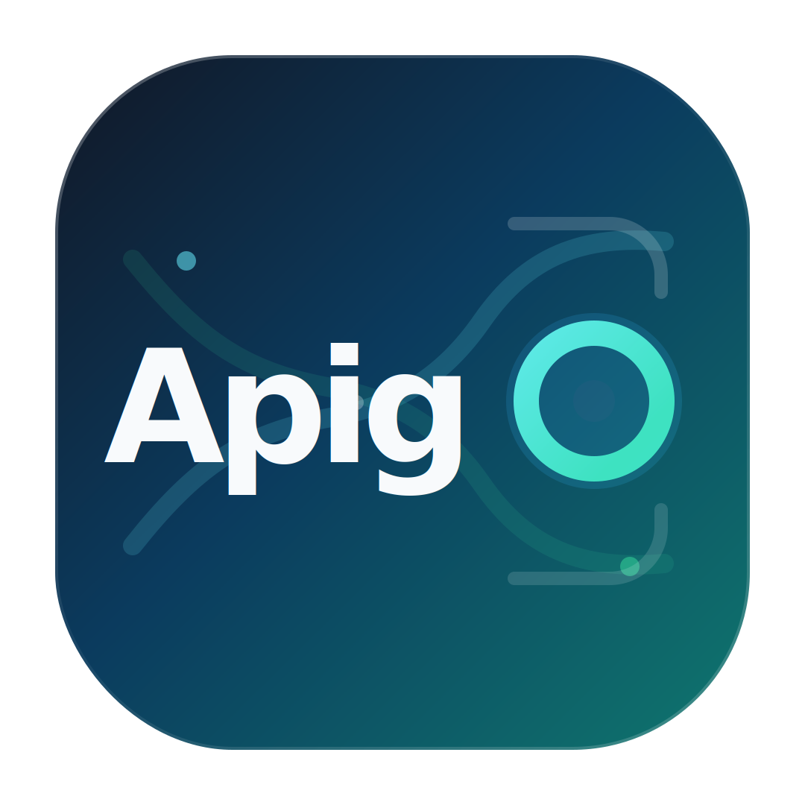

<div align="center">
  
  <h1>Apig0</h1>
  <p><strong>Internal API gateway with a built-in admin portal, per-user gateway keys, one-time key claim delivery, and an OpenAI-compatible AI gateway.</strong></p>
  <p>
    <a href="#why-apig0">Why Apig0</a>&nbsp;&nbsp;&nbsp;
    <a href="#web-ui">Web UI</a>&nbsp;&nbsp;&nbsp;
    <a href="#gateway-tokens">Gateway Tokens</a>&nbsp;&nbsp;&nbsp;
    <a href="#ai-gateway">AI Gateway</a>&nbsp;&nbsp;&nbsp;
    <a href="#cli">CLI</a>
  </p>
</div>

## Why Apig0

Apig0 is a Go-based gateway for teams that need real user-level controls in front of internal APIs without handing upstream secrets directly to every client.

| Core idea | What that means in practice |
| --- | --- |
| User-level gateway access | Assign services and keys per user instead of sharing one internal credential. |
| Safer key delivery | Raw gateway keys are shown once and can be claimed from the user portal. |
| AI-ready front door | Expose approved AI backends behind `https://<gateway>/openai/v1`. |
| Local-first operations | Run and manage the gateway from the Web UI or the built-in CLI. |

## Highlights

- Built-in Web UI for setup, admin workflows, user portal access, token management, and audit visibility.
- Password + TOTP browser login for operators and portal users.
- Standard API access through service-scoped gateway keys and copy-ready request generation.
- AI access through OpenAI-compatible clients with gateway-side service, provider, and model scoping.
- Rate limiting, upstream auth injection, one-time key delivery, and per-route policy enforcement in the gateway layer.

## Contents

- [Why Apig0](#why-apig0)
- [Current Product Shape](#current-product-shape)
- [Route Map](#route-map)
- [Web UI](#web-ui)
- [Gateway Tokens](#gateway-tokens)
- [Admin Flows](#admin-flows)
- [AI Gateway](#ai-gateway)
- [CLI](#cli)
- [Storage Modes](#storage-modes)
- [File and Package Layout](#file-and-package-layout)
- [Operator Notes](#operator-notes)

## Current Product Shape

- Browser login uses password + TOTP.
- Admins manage users, services, saved upstream secrets, rate limits, audit, and gateway tokens.
- Gateway tokens are hashed for authentication.
- Raw gateway keys are shown once at creation or one-time claim time.
- The user portal supports one-time key claim delivery.
- Standard service access now uses a command generator, not a browser terminal.
- AI access uses an OpenAI-compatible route with provider/model scoping.
- The backend can enforce per-user route policies during proxied requests.

## Route Map

- `GET /` serves the Web UI shell.
- `GET /healthz` returns a basic health response.
- `GET /metrics` exposes Prometheus-style gateway metrics.
- `GET /api/setup/status` reports setup and storage mode state.
- `POST /api/setup/complete` completes first-run setup.
- `POST /api/setup/bootstrap-admin` creates an admin when setup exists but no admin remains.
- `POST /auth/login`, `POST /auth/verify`, `POST /auth/logout` handle browser auth.
- `GET /api/user/info` returns current user/session or token context.
- `GET /api/user/pending-keys` lists one-time key deliveries for the logged-in user.
- `POST /api/user/pending-keys/:id/claim` reveals a pending raw key once, then deletes the delivery.
- `GET /api/admin/*` and `POST/PUT/DELETE /api/admin/*` back the admin UI.
- `ANY /openai/v1` and `ANY /openai/v1/*` provide the AI gateway surface for AI-scoped tokens.
- `ANY /{service}/...` proxies traffic to configured upstream services after auth, policy, and rate-limit checks.

## Web UI

The Web UI is split between admin operations and the user portal.

### Portal

The portal is now key-driven, not terminal-driven.

- Standard keys:
  the portal shows `API Access`, assigned endpoint info, key prefix/status, advanced request setup, and a copy-ready curl generator.
- AI keys:
  the portal shows `AI Access`, the AI gateway base URL, backend/model scope, and copyable curl/Python/JavaScript snippets.
- Pending key deliveries:
  if a token was created for the logged-in user, the portal can show a one-time `Claim Key` card.

### Standard API Access

The standard portal flow is:

1. Admin creates a token for a user.
2. User claims the key once in the portal or receives it manually.
3. User selects an allowed service.
4. User adjusts method/path/headers/body in the request generator.
5. User copies the generated command into their preferred client.

The standard portal no longer tries to act like a local shell. It is a copy/paste request generator.

### AI Access

The AI portal flow is:

1. Admin marks a service as AI-gateway-enabled.
2. Admin creates an `ai` token for a user and assigns AI service/model/provider scope.
3. User claims the key once in the portal or receives it manually.
4. User points an OpenAI-compatible client at:

```text
https://<gateway>/openai/v1
```

5. User authenticates with the claimed gateway key, not the upstream provider secret.

## Gateway Tokens

Gateway tokens are first-class user access keys.

### Key Types

- `standard`
  standard service access through `/{service}/...`
- `ai`
  AI access through `/openai/v1`

### Storage Model

- The normal token store keeps:
  - token hash
  - token prefix
  - user
  - key type
  - service/model/provider scope
  - expiry / revoke / last-used state
- The normal token store does not keep the raw token.

### One-Time Delivery Model

When a token is created in the admin UI:

1. the raw token is generated
2. only the hash is stored in the main token store
3. a one-time delivery envelope is created for the assigned user
4. the user can claim the raw key once from the portal
5. after claim, the delivery record is removed

Important:

- If the user loses the raw key after claim, the normal recovery path is rotation or new token creation.
- In persistent mode, pending delivery storage survives restart only when `APIG0_SERVICE_MASTER_PASSWORD` is available.
- The CLI still prints raw tokens directly on `tokens create`, because it is a local operator path rather than the Web claim flow.

## Admin Flows

### Users

- create user
- delete user
- reset TOTP
- configure allowed services

The first admin account is protected:

- it is not deletable through the Web UI
- the backend rejects deletion of that first admin
- full setup reset is the intended destructive recovery path

### Services

Admins can configure:

- service name
- upstream base URL
- auth type
- custom header/basic auth options
- provider label
- OpenAI-compatible exposure flag
- timeout
- retry count
- saved upstream secret

Service secrets can be stored in file or encrypted-file modes depending on setup.

### Tokens

Admins can:

- create tokens
- revoke tokens
- choose `standard` or `ai`
- restrict allowed services
- restrict allowed models/providers for AI keys
- set token-level rate limit overrides
- set expirations

## AI Gateway

The AI gateway is currently OpenAI-compatible on the public wire format.

Supported pattern:

```text
https://<gateway>/openai/v1
```

This allows users to use:

- curl
- OpenAI-compatible SDKs
- tools that support `base_url` plus API key override

The current implementation is still centered on an OpenAI-compatible surface, even though the UI now presents it as a more general AI gateway.

## CLI

`apig0` includes a built-in local operator CLI.

### Server Lifecycle

- `apig0`
- `apig0 start`
- `apig0 serve`
- `apig0 stop`
- `apig0 restart`
- `apig0 status`

### Logs and Monitoring

- `apig0 logs [-n N] [-f]`
- `apig0 monitor [-n N] [-f] [--service name] [--errors]`

### Setup

- `apig0 setup status`
- `apig0 setup reset --force`
- `apig0 setup bootstrap-admin --username <name> --password <pass>`

### Users

- `apig0 users list`
- `apig0 users add --username <name> --password <pass> [--role user|admin] [--services svc1,svc2]`
- `apig0 users delete --username <name>`

### Services

- `apig0 services list`
- `apig0 services add --name <svc> --url <base> [--auth-type ...] [--header ...] [--basic-username ...] [--timeout-ms ...] [--retry-count ...] [--secret ...]`
- `apig0 services delete --name <svc>`

### Tokens

- `apig0 tokens list`
- `apig0 tokens create --user <name> [--name ...] [--services svc1,svc2] [--expires-at RFC3339]`
- `apig0 tokens revoke --id <token-id>`

### CLI Notes

- The CLI works against the same local runtime and storage layer as the Web UI.
- It does not call the HTTP admin API.
- `tokens create` prints the raw token once to stdout.
- The current CLI token creation path is still standard-service-oriented and does not expose the full Web UI AI-token options yet.
- Background server logs are written to a runtime log path, configurable with `APIG0_LOG_PATH`.

## Storage Modes

### Temporary Mode

- setup lasts for the current gateway process
- browser refresh does not erase the active session state
- restarting the gateway returns to first-run setup
- service secrets stay in memory
- pending key delivery claims do not survive restart

### Persistent Mode

- users, services, rate limits, policies, tokens, and setup persist across restart
- service secrets use file-backed persistent modes
- encrypted service-secret mode uses `APIG0_SERVICE_MASTER_PASSWORD`
- pending key deliveries can persist when a master password is available

## File and Package Layout

- [`main.go`](main.go): startup, route wiring, TLS mode, static asset serving.
- [`auth/`](auth): browser session auth, token auth, admin/setup handlers, TOTP flows, token delivery claim endpoints.
- [`config/`](config): runtime config, users, services, service secret metadata, tokens, token deliveries, access policies, audit, setup/runtime storage.
- [`middleware/`](middleware): CORS, CSRF, rate limiting, monitoring, Prometheus output.
- [`proxy/`](proxy): reverse proxy behavior, upstream auth injection, timeout/retry handling, OpenAI-compatible AI proxy.
- [`cli/`](cli): local operator CLI.
- [`features/`](features): implementation notes for larger feature or hardening passes.

### Frontend Files

- [`webui.html`](webui.html): HTML shell only.
- [`static/css/webui.css`](static/css/webui.css): UI styling.
- [`static/vendor/qrcode.min.js`](static/vendor/qrcode.min.js): local QR dependency.
- [`static/js/app-core.js`](static/js/app-core.js): shared app state, DOM helpers, API helpers.
- [`static/js/auth.js`](static/js/auth.js): login, bootstrap admin, session boot, portal session info, pending key delivery loading.
- [`static/js/portal-console.js`](static/js/portal-console.js): standard API command generator, AI access snippets, one-time key claim behavior.
- [`static/js/setup.js`](static/js/setup.js): setup mode selection, storage upgrade, reset flow.
- [`static/js/monitor.js`](static/js/monitor.js): SSE monitor, request log, audit panel, test console.
- [`static/js/admin-services.js`](static/js/admin-services.js): service CRUD and service-secret metadata UI.
- [`static/js/admin-users.js`](static/js/admin-users.js): user CRUD, access controls, protected-admin behavior.
- [`static/js/admin-tokens.js`](static/js/admin-tokens.js): gateway token management, key type selection, claim-delivery-aware creation flow.
- [`static/js/admin-ratelimits.js`](static/js/admin-ratelimits.js): rate limit editor UI.
- [`static/js/navigation.js`](static/js/navigation.js): page switching and per-page data loading.
- [`static/js/bootstrap.js`](static/js/bootstrap.js): delegated event wiring and app startup.

## Operator Notes

- The current Web product expects admins to assign keys to users rather than having users self-generate credentials.
- Standard API users should treat the portal as a command generator, not an execution shell.
- AI users should treat the portal as a client bootstrap screen for OpenAI-compatible SDK usage.
- If a raw key is exposed in the browser after claim, that browser session should be treated as sensitive until logout or page close.
